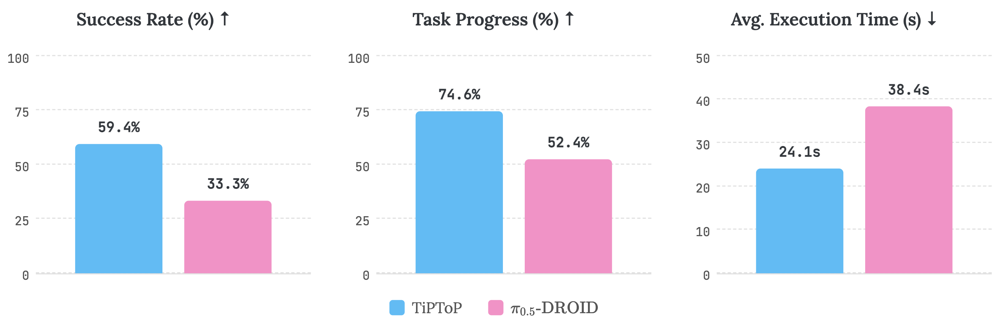
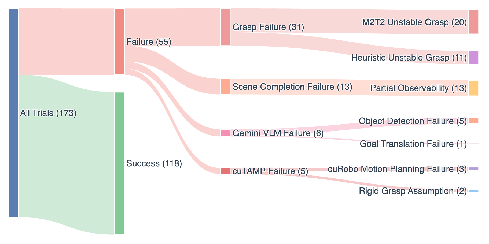

# TiPToP Twitter Thread Draft

## Tweet 1 (Hook)
State-of-the-art robot policies often need hundreds of hours of data. What if we needed none?

Introducing TiPToP: a manipulation system that solves open-world tasks from pixels and language — no robot demos — using vision foundation models and GPU-parallelized TAMP.

(1/10)

<video controls width="100%">
  <source src="media/overview/teaser.mp4" type="video/mp4">
</video>

---

## Tweet 2 (How it works)
How does it work?

**Perception:** FoundationStereo (depth estimation) + M2T2 (6-DoF grasp prediction) + Gemini (semantic grounding) + SAM-2 (object segmentation) → 3D scene representation

**Planning:** cuTAMP synthesizes robot actions by exploring thousands of candidate grasps, placements, and motions in parallel on the GPU, and selects the best feasible plan

No task-specific training required!

(2/10)

<video controls width="100%">
  <source src="media/overview/pipeline.mp4" type="video/mp4">
</video>

---

## Tweet 3 (Motivating example)
Why does this matter?

Simple task: "Place the peanut butter crackers onto the tray" — in a scene full of different cracker packets.

TiPToP succeeds 5 out of 5 trials.
π₀.₅-DROID (SOTA VLA, 350+ hrs of embodiment-specific data) fails all 5 trials.

TiPToP does this by *reasoning* at test time about what's in the scene. A pretrained policy on the other hand often has to have seen something similar in training.

(3/10)

<video controls width="100%">
  <source src="media/results/edited/cracker-hard.mp4" type="video/mp4">
</video>

*TODO: speed up video?*

---

## Tweet 4 (Long-horizon + multi-step)
This test-time reasoning lets TiPToP scale to novel scenarios with more objects and longer horizons.

On multi-step manipulation (sequential picks, obstacle clearing, constrained packing):

TiPToP achieves 57.5% success vs 15% for π₀.₅-DROID

The planner performs physical reasoning by sequencing actions and checking robot kinematic and spatial constraints.

(4/10)

<video controls width="100%">
  <source src="media/results/edited/coffee-pack-obs.mp4" type="video/mp4">
</video>

*TODO: speed up video?*

---

## Tweet 5 (Overall results)
We ran 165 trials across 28 tasks. To ensure broad task coverage and thorough experimentation, most evaluation was performed externally at UPenn by a team not involved in development.

**Results**:
- Success rate: TiPToP 59.4% vs π₀.₅-DROID 33.3%
- Task progress: TiPToP 74.6% vs π₀.₅-DROID 52.4%
- Speed: TiPToP 37% faster when both succeed

(5/10)

---

## Tweet 6 (Failure analysis + modularity)
A key benefit of modularity: we can trace exactly where failures happen. Across 54 failed trials:

- 31 grasping
- 13 partial observability / mesh reconstruction
- 6 VLM
- 5 planning

TiPToP improves as components improve: drop in a better grasp model, get a better system.

(6/10)

---

## Tweet 7 (Cross-embodiment)
TiPToP isn't tied to one robot.

We deployed it on a Franka, UR5e, and Trossen WidowX AI — each time just swapping in a new URDF and robot configs.

No retraining. No new demonstrations. Same perception and planning code.

(7/10)

<video controls width="100%">
  <source src="tweet_videos/cross-embodiment.mp4" type="video/mp4">
</video>

---

## Tweet 8 (Beyond pick-and-place)
TiPToP also extends beyond pick-and-place.

We added a whiteboard wiping skill in under a day without modifying existing perception or execution code.

Skills compose: "erase the whiteboard and put everything into the bowl" just works.

(8/10)

<video controls width="100%">
  <source src="tweet_videos/wipe-tweet.mp4" type="video/mp4">
</video>

---

## Tweet 9 (Limitations + future)
TiPToP is far from perfect:

- Open-loop execution → no recovery from failed grasps
- Single-viewpoint perception → limited visibility
- Lacks closed-loop reactivity of VLAs

We view TiPToP as a test-time scaling and reasoning method that's ultimately complementary to large robot foundation models like VLAs. We're excited about future research to more tightly combine these paradigms!

(9/10)

---

## Tweet 10 (Closing)
We hope you'll try TiPToP out and consider contributing! While we're excited by TiPToP's current capabilities, we also feel there's so much more to be done (check out the website for a list of things to be worked on).

🌐 Project: https://tiptop-robot.github.io
📄 Paper: https://tiptop-robot.github.io/tiptop.pdf
💻 Code (coming soon): https://github.com/tiptop-robot/tiptop

TiPToP was a big team effort and wouldn't have been possible without @WillShenSaysHi, @sahitbot_irl, @JieWang_ZJUI, Christopher Watson, @_jingcao, @edward_s_hu, @dineshjayaraman, Leslie Pack Kaelbling, and Tomás Lozano-Pérez.

Special thanks to the folks at Penn for their help with evaluation!

(10/10)
